<<<<<<< HEAD
<div align="center">



<br/>


<br/>

[](#)
[](#)
[](https://leetcode.com/SalladdinCodes/)
[](https://github.com/EnzoCodes786)

</div>

<br/>

```bash
aryan@devbox:~$ cat about.md
```

## About

I'm a third-year Computer Science undergraduate at **Jamia Millia Islamia**, working mainly on
backend systems and full-stack applications with the MERN stack, and spending the rest of my
time going deeper into machine learning and system design.

I like building things that have a real backend behind them — auth flows, databases, caching,
APIs that actually hold up — rather than just the UI on top. Most of what's below came out of
shipping actual projects, including client work, not tutorials.

```text
role        Full Stack Developer · Machine Learning Enthusiast
education   B.Tech Computer Science Engineering — Jamia Millia Islamia
based in    India
focus       Backend Development · Machine Learning · System Design
```

<br/>

```bash
aryan@devbox:~$ cat tech-stack.md
```

## Tech Stack

<table>
<tr>
<td valign="top" width="50%">

**Languages**


**Frontend**


**Backend**


</td>
<td valign="top" width="50%">

**Database**


**DevOps**


**Machine Learning**


</td>
</tr>
</table>

<br/>

```bash
aryan@devbox:~$ cat currently-learning.md
```

## Currently Learning


<br/>
<br/>

```bash
aryan@devbox:~$ ls projects/ --featured
```

## Featured Projects

<table>
<tr>
<td width="50%" valign="top">

### [Shiori — AI Notes App](https://github.com/EnzoCodes786/shiori)

AI-powered notes application with OTP-based authentication and Gemini AI
integration for smart note generation.

`React` `Node.js` `Express` `MySQL` `JWT` `OTP Auth` `Gemini AI`

Auth · Notes CRUD · AI Integration · Responsive UI

</td>
<td width="50%" valign="top">

### [URL Shortener](https://github.com/EnzoCodes786/url-shortener)

A production-style URL shortener with Redis caching for fast redirects
and click analytics.

`Node.js` `Express` `Redis`

Analytics · Short Links · Redis Caching

</td>
</tr>
<tr>
<td width="50%" valign="top">

### [AI Student Manager](https://github.com/EnzoCodes786/ai-student-manager)

A student management tool with a conversational layer powered by the
Gemini API.

`React` `Node.js` `Gemini API`

</td>
<td width="50%" valign="top">

### [Heart Disease Predictor](https://github.com/EnzoCodes786/heart-disease-predictor)

Logistic regression model trained on clinical data to classify heart
disease risk.

`Python` `scikit-learn` `Logistic Regression`

</td>
</tr>
<tr>
<td width="50%" valign="top">

### [Retro Rocket](https://github.com/EnzoCodes786/retro-rocket)

A 2D arcade-style rocket game built from scratch with Raylib and C++.

`C++` `Raylib`

</td>
<td width="50%" valign="top">

<br/>

*More on [github.com/EnzoCodes786](https://github.com/EnzoCodes786?tab=repositories)*

</td>
</tr>
</table>

<br/>

```bash
aryan@devbox:~$ curl api.github.com/stats --live
```

## GitHub Stats

<div align="center">


<br/>


<br/>
<br/>


</div>

<br/>

```bash
aryan@devbox:~$ ./scripts/render_contribution_snake.sh
```

## Contribution Snake

<div align="center">

</div>

<sub>Regenerated daily via <code>.github/workflows/snake.yml</code>.</sub>

<br/>
<br/>

```bash
aryan@devbox:~$ curl leetcode.com/SalladdinCodes --stats
```

## LeetCode

<div align="center">

</div>

<br/>

```bash
aryan@devbox:~$ cat connect.md
```

## Connect

<div align="center">

[](https://github.com/EnzoCodes786)
[](https://leetcode.com/SalladdinCodes/)
[](#)
[](#)

</div>

<br/>

<div align="center">

</div>

<br/>

<div align="center">
<sub>Built with backend-first thinking. Views compiled, not just committed.</sub>
<br/>
<sub><!--LAST_SYNCED-->Last synced: 06 Aug 2026, 00:00 IST<!--/LAST_SYNCED--></sub>
</div>
=======
## Hi there 👋

<!--
**EnzoCodes786/EnzoCodes786** is a ✨ _special_ ✨ repository because its `README.md` (this file) appears on your GitHub profile.

Here are some ideas to get you started:

- 🔭 I’m currently working on ...
- 🌱 I’m currently learning ...
- 👯 I’m looking to collaborate on ...
- 🤔 I’m looking for help with ...
- 💬 Ask me about ...
- 📫 How to reach me: ...
- 😄 Pronouns: ...
- ⚡ Fun fact: ...
-->
>>>>>>> 4db4aec89d2e7c256d7c78d55ee0e2d541940ec9
